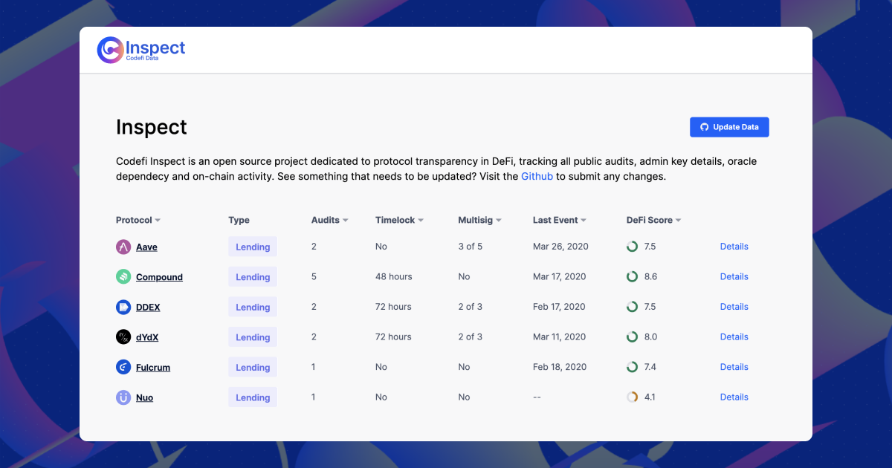

# Inspect

Inspect is an open source project dedicated to protocol transparency in DeFi. It tracks all public audits, admin key details, oracle dependency and on-chain activity for some of the top DeFi protocols.

The data in this repository powers the Inspect transparency dashboard.

We encourage the Ethereum community to get involved. The data here can be audited, maintained, and updated by the community. See something that’s not quite right? Are we missing your favorite platform or product? Submit a [pull request](https://github.com/ConsenSys/inspect-data/compare) and we’ll get in a fix.

* See the DeFi transparency dashboard: [Codefi Inspect](https://inspect.codefi.network/)
* Join the discussion on [Telegram](https://t.me/defiscore)
* Learn more about the [Codefi Data API](https://codefi.consensys.net/data)

## What is it?
From the ConsenSys team that brought you the [DeFi Score](http://defiscore.io/), Codefi Inspect is a community-driven DeFi protocol registry that tracks code audits, details of admin capabilities, and onchain transactions. It is a source of protocol data that is both reliable and verifiable.

We’re launching with lending protocol analysis, but plan to expand to include additional DeFi platforms and products in the near future.

## What does it track?

### I. Audits

Errors, bugs and unexpected outcomes in smart contracts can cause real financial harm. These risks can be minimized by proactive code audits from reputable security firms.

With Inspect, you’ll now be able to answer the following questions about each protocol:
* When was their last audit?
* Which firm performed it?
* How much effort (developer-hours) went into the audit?
* Is it public?

You’ll also be able to review the firm’s PDF report for each audit performed.

### II. Admin Keys

Most of the top DeFi protocols have some element of centralized control diving developers an ‘administrator’ address to make potentially significant changes to the platform. This means you need to trust the project to not abuse their authority.

Our information on admin key risk was originally sourced by [Chris Blec](https://twitter.com/ChrisBlec) at [DeFi Watch](https://defiwatch.net/).

### III. Oracles

Oracle methods and contract addresses used by each platform. Originaly sourced by [Linda Xie](https://twitter.com/ljxie) in her [repo](https://github.com/linda-xie/defi-oracles).

### IV. On-Chain Events

Inspect also shows information related to events made on-chain. This includes admin key invocations, contract upgrades, changes to timelocks, and additional transactions. You can see those events that have been executed and those that are currently sitting in a timelock.

### V. DeFi Score
When available, we show the protocol’s average DeFi Score along with a breakdown of each pool. A related project from Codefi, the [DeFi Score](http://defiscore.io/) is a framework for assessing risk in permissionless lending platforms. It's a single, consistently comparable value for measuring protocol risk, based on factors including smart contract risk, collateralization, and liquidity.

## Community-Driven
We take taking a decentralized approach to validating these decentralized protocols. Everything you see in Codefi Inspect can be audited, maintained, and updated by the community. See something that’s not quite right? Are we missing your favorite platform or product? Submit a [pull request](https://github.com/ConsenSys/inspect-data/compare) and we’ll get in a fix.  
